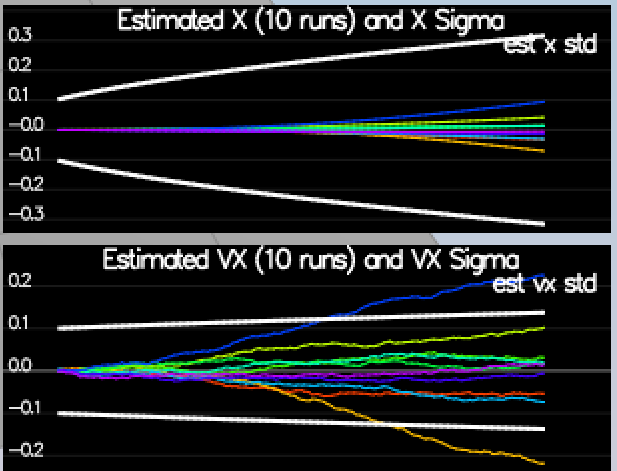
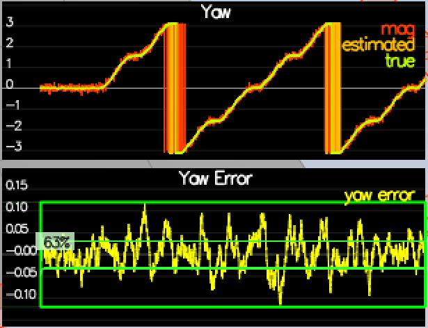

# 3D Quadrotor Estimation

This estimation project is built on top of the controls project for quadrotor that you can find [here](https://github.com/Rish619/FCND-Controls-CPP).  In this project,  the estimation portion of the controller used in the CPP simulator is developed.  The objective of this project was to simulate quad flying with the estimator running in parallel with and the custom controller (designed and tuned in the  project stated above)! 
When it comes to the real world measurements are noise prone and consist an element of noise in almost all the measurement, to tackle this; An Estimator should handle these anomalies and remove them so that prediction is correct or close to the actual value/ground truth. In this project an [Extended Kalman Filter(EKF)](https://en.wikipedia.org/wiki/Extended_Kalman_filter) is used, we need to fusio noisy [GPS](https://en.wikipedia.org/wiki/Global_Positioning_System), [IMU](https://en.wikipedia.org/wiki/Inertial_measurement_unit), and compass(magnetometer) to estimate current drone position, velocity, and yaw. The EKF has already been implemented using C++ with the code provided by Udacity on the [seed project](https://github.com/udacity/FCND-Estimation-CPP).

This README is broken down into the following sections:

 - [Setup](#setup) - the environment and code setup required to get started and a brief overview of the project structure
 - [The Tasks](#the-tasks) - the tasks you will need to complete for the project
 - [Tips and Tricks](#tips-and-tricks) - some additional tips and tricks you may find useful along the way
 - [Submission](#submission) - overview of the requirements for your project submission


## Setup ##

This project will continue to use the C++ development environment you set up in the Controls C++ project.

 1. Clone the repository
 ```
 git clone https://github.com/udacity/FCND-Estimation-CPP.git
 ```

 2. Import the code into your IDE like done in the [Controls C++ project](https://github.com/udacity/FCND-Controls-CPP#development-environment-setup)
 
 3. You should now be able to compile and run the estimation simulator just as you did in the controls project


### Project Structure ###

For this project, some of the files used and interacted with are:

- The EKF forms a  very small part of the code base. Most of the code provided is the drone simulator. The code is int the /src directory, and the following are the files where changes are to be made:

- /config/QuadEstimatorEKF.txt: This file consists of the parameters those are required for tuning the EKF. As done during tuning the control parameters, we don't need to restart or re make the CPPSIM file ;  the simulator after parameters modifications. This project is not as heavy as the control project on tuning, but it is good to have this feature for real world scenarios to deal with the sensor and the process noise.

- /src/QuadEstimatorEKF.cpp: This is the seed or default EKF implementation. There are sections of the code those are  to be filled.
/src/QuadControl.cpp: This is the cascade PID control implemented in the controls project that is referred above. There has been a nice seed implementation of the controller to complete the tasks in this project except the last task where you need to replace this implementation of the controller with the one written in the control github repo referred above. 

- /config/QuadControlParams.txt: It contains the control parameters those are set for the tasks completion in this estimation project.

#### `config` Directory ####

In the `config` directory, in addition to finding the configuration files for your controller and your estimator, you will also see configuration files for each of the simulations.  For this project, you will be working with simulations 06 through 11 and you may find it insightful to take a look at the configuration for the simulation.

As an example, if we look through the configuration file for scenario 07, we see the following parameters controlling the sensor:

```
# Sensors
Quad.Sensors = SimIMU
# use a perfect IMU
SimIMU.AccelStd = 0,0,0
SimIMU.GyroStd = 0,0,0
```

This configuration tells us that the simulator is only using an IMU and the sensor data will have no noise.  You will notice that for each simulator these parameters will change slightly as additional sensors are being used and the noise behavior of the sensors change.


## The Tasks ##

Once again, you will be building up your estimator in pieces.  At each step, there will be a set of success criteria that will be displayed both in the plots and in the terminal output to help you along the way.

Project outline:

 - [Step 1: Sensor Noise](#step-1-sensor-noise)
 - [Step 2: Attitude Estimation](#step-2-attitude-estimation)
 - [Step 3: Prediction Step](#step-3-prediction-step)
 - [Step 4: Magnetometer Update](#step-4-magnetometer-update)
 - [Step 5: Closed Loop + GPS Update](#step-5-closed-loop--gps-update)
 - [Step 6: Adding Your Controller](#step-6-adding-your-controller)


### Step 1: Sensor Noise ###

For the controls project, the simulator was working with a perfect set of sensors, meaning none of the sensors had any noise.  The first step to adding additional realism to the problem, and developing an estimator, is adding noise to the quad's sensors.  For the first step, you will collect some simulated noisy sensor data and estimate the standard deviation of the quad's sensor.

1. Run the simulator in the same way as you have before

Result with seed settings:
<p align="center">

</p>

```
Simulation #10 (../config/06_SensorNoise.txt)
FAIL: ABS(Quad.GPS.X-Quad.Pos.X) was less than MeasuredStdDev_GPSPosXY for 99% of the time
FAIL: ABS(Quad.IMU.AX-0.000000) was less than MeasuredStdDev_AccelXY for 18% of the time

```

Note: the scenario to be selected for this is "06_SensorNoise.txt" and has to be set in the file `config\LastScenario.txt` before running this test.

2. Choose scenario `06_NoisySensors`.  In this simulation, the interest is to record some sensor data on a static quad, so you will not see the quad move.  You will see two plots at the bottom, one for GPS X position and one for The accelerometer's x measurement.  The dashed lines are a visualization of a single standard deviation from 0 for each signal. The standard deviations are initially set to arbitrary values (after processing the data in the next step, you will be adjusting these values).  If they were set correctly, we should see ~68% of the measurement points fall into the +/- 1 sigma bound.  When you run this scenario, the graphs you see will be recorded to the following csv files with headers: `config/log/Graph1.txt` (GPS X data) and `config/log/Graph2.txt` (Accelerometer X data).

3.  Used `process_sensor_noise_std.py` to calculate the standard deviation values for the both GPS and IMU accelerometer measurements. Values calculate were (MeasuredStdDev_GPSPosXY = 0.6601210006202937, MeasuredStdDev_AccelXY = 0.48476061505594636) and replaced the default values to these in the file `06_SensorNoise.txt`


4. Plug in your result into the top of `config/6_Sensornoise.txt`.  Specially, set the values for `MeasuredStdDev_GPSPosXY` and `MeasuredStdDev_AccelXY` to be the values you have calculated.

5. Run the simulator. If your values are correct, the dashed lines in the simulation will eventually turn green, indicating you’re capturing approx 68% of the respective measurements (which is what we expect within +/- 1 sigma bound for a Gaussian noise model)

***Success criteria:*** *Your standard deviations should accurately capture the value of approximately 68% of the respective measurements.*

NOTE: Your answer should match the settings in `SimulatedSensors.txt`, where you can also grab the simulated noise parameters for all the other sensors.

Result:

<p align="center">

</p>

```
Simulation #8 (../config/06_SensorNoise.txt)
PASS: ABS(Quad.GPS.X-Quad.Pos.X) was less than MeasuredStdDev_GPSPosXY for 67% of the time
PASS: ABS(Quad.IMU.AX-0.000000) was less than MeasuredStdDev_AccelXY for 67% of the time

```

### Step 2: Attitude Estimation ###

Now let's look at the first step to our state estimation: including information from our IMU.  In this step, you will be improving the complementary filter-type attitude filter with a better rate gyro attitude integration scheme.

1. Run scenario `07_AttitudeEstimation`.  For this simulation, the only sensor used is the IMU and noise levels are set to 0 (see `config/07_AttitudeEstimation.txt` for all the settings for this simulation).  There are two plots visible in this simulation.
   - The top graph is showing errors in each of the estimated Euler angles.
   - The bottom shows the true Euler angles and the estimates.
Observe that there’s quite a bit of error in attitude estimation.

`UpdateFromIMU()` default implementation Linear Scheme:

```c++

float predictedPitch = pitchEst + dtIMU * gyro.y;
float predictedRoll = rollEst + dtIMU * gyro.x;
ekfState(6) = ekfState(6) + dtIMU * gyro.z;	// yaw

// normalize yaw to -pi .. pi
if (ekfState(6) > F_PI) ekfState(6) -= 2.f*F_PI;
if (ekfState(6) < -F_PI) ekfState(6) += 2.f*F_PI;

```

Result with seed settings and `UpdateFromIMU()`:

<p align="center">

</p>

```
Simulation #21 (../config/07_AttitudeEstimation.txt)
FAIL: ABS(Quad.Est.E.MaxEuler) was less than 0.100000 for 0.000000 seconds, which was less than 3.000000 seconds

```

Note: the scenario to be selected for this is "07_AttitudeControl.txt" and has to be set in the file `config\LastScenario.txt` before running this test.

2. In `QuadEstimatorEKF.cpp`, you will see the function `UpdateFromIMU()` contains a complementary filter-type attitude filter.  To reduce the errors in the estimated attitude (Euler Angles), implement a better rate gyro attitude integration scheme.  You should be able to reduce the attitude errors to get within 0.1 rad for each of the Euler angles, as shown in the screenshot below.

`UpdateFromIMU()` updated and improved implementation Non linear Scheme:

```c++

float yawEst = ekfState(6);
Quaternion<float> qt = Quaternion<float>::FromEuler123_RPY(rollEst, pitchEst, yawEst);
qt = qt.IntegrateBodyRate(gyro, dtIMU);

float predictedPitch = qt.Pitch();
float predictedRoll = qt.Roll();
ekfState(6) = qt.Yaw();

// normalize yaw to -pi .. pi
if (ekfState(6) > F_PI) ekfState(6) -= 2.f*F_PI;
if (ekfState(6) < -F_PI) ekfState(6) += 2.f*F_PI;

```

Result:

<p align="center">

</p>

```
Simulation #19 (../config/07_AttitudeEstimation.txt)
PASS: ABS(Quad.Est.E.MaxEuler) was less than 0.100000 for at least 3.000000 seconds

```


In the above gifs  the attitude estimation using linear scheme  and then using the improved nonlinear scheme . Note that Y axis on error was much greater in the seed implementation of the UpdateIMU() than improved non linear version.

***Success criteria:*** *Your attitude estimator needs to get within 0.1 rad for each of the Euler angles for at least 3 seconds.*

**Hint: see section 7.1.2 of [Estimation for Quadrotors](https://www.overleaf.com/read/vymfngphcccj) for a refresher on a good non-linear complimentary filter for attitude using quaternions.**


### Step 3: Prediction Step ###

In this next step you will be implementing the prediction step of your filter.


1. Run scenario `08_PredictState`.  This scenario is configured to use a perfect IMU (only an IMU). Due to the sensitivity of double-integration to attitude errors, we've made the accelerometer update very insignificant (`QuadEstimatorEKF.attitudeTau = 100`).  The plots on this simulation show element of your estimated state and that of the true state.  At the moment you should see that your estimated state does not follow the true state.

Result with seed settings and estimated state does not follow true state:

<p align="center">

</p>

Note: the scenario to be selected for this is "08_PredictState.txt" and has to be set in the file `config\LastScenario.txt` before running this test.

2. In `QuadEstimatorEKF.cpp`, implement the state prediction step in the `PredictState()` function. If you do it correctly, when you run scenario `08_PredictState` you should see the estimator state track the actual state, with only reasonably slow drift, as shown in the figure below:

`PredictState()` implementation:

```c++

Quaternion<float> attitude = Quaternion<float>::FromEuler123_RPY(rollEst, pitchEst, curState(6));

////////////////////////////// BEGIN STUDENT CODE ///////////////////////////
V3F acc = attitude.Rotate_BtoI(accel);
predictedState(0) = curState(0) + curState(3) * dt;
predictedState(1) = curState(1) + curState(4) * dt;
predictedState(2) = curState(2) + curState(5) * dt;
predictedState(3) = curState(3) + acc.x * dt;
predictedState(4) = curState(4) + acc.y * dt;
predictedState(5) = curState(5) + (acc.z - 9.81) * dt;

```

Result:
<p align="center">

</p>


3. Now let's introduce a realistic IMU, one with noise.  Run scenario `09_PredictionCov`. You will see a small fleet of quadcopter all using your prediction code to integrate forward. You will see two plots:
   - The top graph shows 10 (prediction-only) position X estimates
   - The bottom graph shows 10 (prediction-only) velocity estimates
You will notice however that the estimated covariance (white bounds) currently do not capture the growing errors.

Result using seed implementation:
<p align="center">

</p>

Note: the scenario to be selected for this is "09_PredictCovariance.txt" and has to be set in the file `config\LastScenario.txt` before running this test.

4. In `QuadEstimatorEKF.cpp`, calculate the partial derivative of the body-to-global rotation matrix in the function `GetRbgPrime()`.  Once you have that function implement, implement the rest of the prediction step (predict the state covariance forward) in `Predict()`.

`GetRbgPrime()` implementation:

```c++

// first, figure out the Rbg_prime
  MatrixXf RbgPrime(3, 3);
  RbgPrime.setZero();

  // Return the partial derivative of the Rbg rotation matrix with respect to yaw. We call this RbgPrime.
  // INPUTS: 
  //   roll, pitch, yaw: Euler angles at which to calculate RbgPrime
  //   
  // OUTPUT:
  //   return the 3x3 matrix representing the partial derivative at the given point

  // HINTS
  // - this is just a matter of putting the right sin() and cos() functions in the right place.
  //   make sure you write clear code and triple-check your math
  // - You can also do some numerical partial derivatives in a unit test scheme to check 
  //   that your calculations are reasonable

  ////////////////////////////// BEGIN STUDENT CODE ///////////////////////////
  float sr = sin(roll);
  float cr = cos(roll);

  // Pitch Theta Y
  float sp = sin(pitch);
  float cp = cos(pitch);

  // Yaw Psi Z
  float sy = sin(yaw);
  float cy = cos(yaw);

  RbgPrime(0,0) = -cp *  sy;
  RbgPrime(1,0) =  cp *  cy;
  RbgPrime(2,0) = 0.0;

  RbgPrime(0,1) = -sr * sp * sy - cr * cy;
  RbgPrime(1,1) =  sr * sp * cy - cr * sy;
  RbgPrime(2,1) = 0.0;

  RbgPrime(0,2) = -cr * sp * sy + sr * cy;
  RbgPrime(1,2) =  cr * sp * cy + sr * sy;
  RbgPrime(2,2) = 0.0;

  /////////////////////////////// END STUDENT CODE ////////////////////////////

  return RbgPrime;


```

Calling `GetRbgPrime()` in `Predict()` and also predicting the state covariance forward in time:

```c++

  // predict the state forward
  VectorXf newState = PredictState(ekfState, dt, accel, gyro);

  
  // we'll want the partial derivative of the Rbg matrix
  MatrixXf RbgPrime = GetRbgPrime(rollEst, pitchEst, ekfState(6));

  // we've created an empty Jacobian for you, currently simply set to identity
  MatrixXf gPrime(QUAD_EKF_NUM_STATES, QUAD_EKF_NUM_STATES);
  gPrime.setIdentity();

  ////////////////////////////// BEGIN STUDENT CODE ///////////////////////////
  VectorXf u(3);

  u<<accel[0],accel[1],accel[2];

  VectorXf Rgb_u = RbgPrime * (u * dt);

  gPrime(0,3) = dt;
  gPrime(1,4) = dt;
  gPrime(2,5) = dt;
  gPrime(3,6) = Rgb_u(0);
  gPrime(4,6) = Rgb_u(1);
  gPrime(5,6) = Rgb_u(2);

  MatrixXf gPrimeT = gPrime.transpose();
  ekfCov = gPrime * (ekfCov * (gPrimeT)) + Q;

  /////////////////////////////// END STUDENT CODE ////////////////////////////

  ekfState = newState;

```

Result:

<p align="center">

</p>


**Hint: see section 7.2 of [Estimation for Quadrotors](https://www.overleaf.com/read/vymfngphcccj) for a refresher on the the transition model and the partial derivatives you may need**

**Hint: When it comes to writing the function for GetRbgPrime, make sure to triple check you've set all the correct parts of the matrix.**

**Hint: recall that the control input is the acceleration!**

5. Run your covariance prediction and tune the `QPosXYStd` (QPosXYStd = .1) and the `QVelXYStd` (QVelXYStd = .25) process parameters in `QuadEstimatorEKF.txt` to try to capture the magnitude of the error you see. Note that as error grows our simplified model will not capture the real error dynamics (for example, specifically, coming from attitude errors), therefore  try to make it look reasonable only for a relatively short prediction period (the scenario is set for one second).  A good solution looks as follows:


Looking at this result, you can see that in the first part of the plot, our covariance (the white line) grows very much like the data.

If we look at an example with a `QPosXYStd` that is much too high (shown below), we can see that the covariance no longer grows in the same way as the data.



Another set of bad examples is shown below for having a `QVelXYStd` too large (first) and too small (second).  As you can see, once again, our covariances in these cases no longer model the data well.


***Success criteria:*** *This step doesn't have any specific measurable criteria being checked.*


### Step 4: Magnetometer Update ###

Up until now we've only used the accelerometer and gyro for our state estimation.  In this step, you will be adding the information from the magnetometer to improve  filter's performance in estimating the vehicle's heading.

1. Run scenario `10_MagUpdate`.  This scenario uses a realistic IMU, but the magnetometer update hasn’t been implemented yet. As a result, you will notice that the estimate yaw is drifting away from the real value (and the estimated standard deviation is also increasing).  Note that in this case the plot is showing you the estimated yaw error (`quad.est.e.yaw`), which is drifting away from zero as the simulation runs.  You should also see the estimated standard deviation of that state (white boundary) is also increasing.


Result using seed implementation:

<p align="center">

</p>

```

Simulation #2 (../config/10_MagUpdate.txt)
FAIL: ABS(Quad.Est.E.Yaw) was less than 0.120000 for 0.000000 seconds, which was less than 10.000000 seconds
PASS: ABS(Quad.Est.E.Yaw-0.000000) was less than Quad.Est.S.Yaw for 66% of the time

```

Note: the scenario to be selected for this is "10_MagUpdate.txt" and has to be set in the file `config\LastScenario.txt` before running this test.

2. Tune the parameter `QYawStd`(QYawStd = .15) (`QuadEstimatorEKF.txt`) for the QuadEstimatorEKF so that it approximately captures the magnitude of the drift, as demonstrated here:

Result:

<p align="center">

</p>

```
Simulation #11 (../config/10_MagUpdate.txt)
FAIL: ABS(Quad.Est.E.Yaw) was less than 0.120000 for 0.000000 seconds, which was less than 10.000000 seconds
FAIL: ABS(Quad.Est.E.Yaw-0.000000) was less than Quad.Est.S.Yaw for 100% of the time

```


3. Implement magnetometer update in the function `UpdateFromMag()`.  Once completed, you should see a resulting plot similar to this one:

`UpdateFromMag()` implementation:

```c++

VectorXf z(1), zFromX(1);
  z(0) = magYaw;

  MatrixXf hPrime(1, QUAD_EKF_NUM_STATES);
  hPrime.setZero();

  // MAGNETOMETER UPDATE
  // Hints: 
  //  - Your current estimated yaw can be found in the state vector: ekfState(6)
  //  - Make sure to normalize the difference between your measured and estimated yaw
  //    (you don't want to update your yaw the long way around the circle)
  //  - The magnetomer measurement covariance is available in member variable R_Mag
  ////////////////////////////// BEGIN STUDENT CODE ///////////////////////////
  hPrime(0,6) = 1.0;
  zFromX(0) = ekfState(6);
  if (zFromX(0) - z(0) > F_PI) {
    zFromX(0) -= 2.f * F_PI;
  }
  else if (zFromX(0) - z(0) < -F_PI) {
    zFromX(0) += 2.f * F_PI;
  }

  /////////////////////////////// END STUDENT CODE ////////////////////////////

  Update(z, hPrime, R_Mag, zFromX);

```
Result:

<p align="center">

</p>

```
Simulation #23 (../config/10_MagUpdate.txt)
PASS: ABS(Quad.Est.E.Yaw) was less than 0.120000 for at least 10.000000 seconds
PASS: ABS(Quad.Est.E.Yaw-0.000000) was less than Quad.Est.S.Yaw for 72% of the time

```


***Success criteria:*** *Your goal is to both have an estimated standard deviation that accurately captures the error and maintain an error of less than 0.1rad in heading for at least 10 seconds of the simulation.*

**Hint: after implementing the magnetometer update, you may have to once again tune the parameter `QYawStd` to better balance between the long term drift and short-time noise from the magnetometer.**

**Hint: see section 7.3.2 of [Estimation for Quadrotors](https://www.overleaf.com/read/vymfngphcccj) for a refresher on the magnetometer update.**


### Step 5: Closed Loop + GPS Update ###

1. Run scenario `11_GPSUpdate`.  At the moment this scenario is using both an ideal estimator and and ideal IMU.  Even with these ideal elements, watch the position and velocity errors (bottom right). As you see they are drifting away, since GPS update is not yet implemented.

Result using seed implementation:

<p align="center">

</p>

```
Simulation #18 (../config/11_GPSUpdate.txt)
FAIL: ABS(Quad.Est.E.Pos) was less than 1.000000 for 0.000000 seconds, which was less than 20.000000 seconds

```
Note: the scenario to be selected for this is "11_GPSUpdate.txt" and has to be set in the file `config\LastScenario.txt` before running this test.

2. Let's change to using your estimator by setting `Quad.UseIdealEstimator` to 0 in `config/11_GPSUpdate.txt`.  Rerun the scenario to get an idea of how well your estimator work with an ideal IMU.

Result:
<p align="center">

</p>

```
Simulation #9 (../config/11_GPSUpdate.txt)
FAIL: ABS(Quad.Est.E.Pos) was less than 1.000000 for 0.000000 seconds, which was less than 20.000000 seconds

```

3. Now repeat with realistic IMU by commenting out these lines in `config/11_GPSUpdate.txt`:
```
#SimIMU.AccelStd = 0,0,0
#SimIMU.GyroStd = 0,0,0
```

Result:
<p align="center">

</p>
```
Simulation #12 (../config/11_GPSUpdate.txt)
FAIL: ABS(Quad.Est.E.Pos) was less than 1.000000 for 0.000000 seconds, which was less than 20.000000 seconds

```

4. Tune the process noise model in `QuadEstimatorEKF.txt` to try to approximately capture the error you see with the estimated uncertainty (standard deviation) of the filter.(# GPS measurement std deviations: GPSPosXYStd = 1,
GPSPosZStd = 3, GPSVelXYStd = .1, GPSVelZStd = .3)

5. Implement the EKF GPS Update in the function `UpdateFromGPS()`.

`UpdateFromGPS()` implementation:

```c++

VectorXf z(6), zFromX(6);
  z(0) = pos.x;
  z(1) = pos.y;
  z(2) = pos.z;
  z(3) = vel.x;
  z(4) = vel.y;
  z(5) = vel.z;

  MatrixXf hPrime(6, QUAD_EKF_NUM_STATES);
  hPrime.setZero();

  // GPS UPDATE
  // Hints: 
  //  - The GPS measurement covariance is available in member variable R_GPS
  //  - this is a very simple update
  ////////////////////////////// BEGIN STUDENT CODE ///////////////////////////
  hPrime(0,0) = 1.0;
  hPrime(1,1) = 1.0;
  hPrime(2,2) = 1.0;
  hPrime(3,3) = 1.0;
  hPrime(4,4) = 1.0;
  hPrime(5,5) = 1.0;

  zFromX(0) = ekfState(0);
  zFromX(1) = ekfState(1);
  zFromX(2) = ekfState(2);
  zFromX(3) = ekfState(3);
  zFromX(4) = ekfState(4);
  zFromX(5) = ekfState(5);
  /////////////////////////////// END STUDENT CODE ////////////////////////////

  Update(z, hPrime, R_GPS, zFromX);


```


6. Now once again re-run the simulation.  Your objective is to complete the entire simulation cycle with estimated position error of < 1m (you’ll see a green box over the bottom graph if you succeed).  You may want to try experimenting with the GPS update parameters to try and get better performance.

Result:

<p align="center">

</p>

```
Simulation #19 (../config/11_GPSUpdate.txt)
PASS: ABS(Quad.Est.E.Pos) was less than 1.000000 for at least 20.000000 seconds

```

***Success criteria:*** *Your objective is to complete the entire simulation cycle with estimated position error of < 1m.*

**Hint: see section 7.3.1 of [Estimation for Quadrotors](https://www.overleaf.com/read/vymfngphcccj) for a refresher on the GPS update.**

At this point, congratulations on having a working estimator!

### Step 6: Adding Your Controller ###

Up to this point, we have been working with a controller that has been relaxed to work with an estimated state instead of a real state.  So now, you will see how well your controller performs and de-tune your controller accordingly.

1. Replace `QuadController.cpp` with the controller you wrote in the last project.

2. Replace `QuadControlParams.txt` with the control parameters you came up with in the last project.

3. Run scenario `11_GPSUpdate`. If your controller crashes immediately do not panic. Flying from an estimated state (even with ideal sensors) is very different from flying with ideal pose. You may need to de-tune your controller. Decrease the position and velocity gains (we’ve seen about 30% detuning being effective) to stabilize it.  Your goal is to once again complete the entire simulation cycle with an estimated position error of < 1m.

Result with seed QuadControl.cpp:

<p align="center">

</p>

```
Simulation #11 (../config/11_GPSUpdate.txt)
PASS: ABS(Quad.Est.E.Pos) was less than 1.000000 for at least 20.000000 seconds

```

Result with my QuadControl.cpp:

<p align="center">

</p>

```
Simulation #19 (../config/11_GPSUpdate.txt)
PASS: ABS(Quad.Est.E.Pos) was less than 1.000000 for at least 20.000000 seconds

```

Note: the scenario to be selected for this is "11_GPSUpdate.txt" and has to be set in the file `config\LastScenario.txt` before running this test. Also i have replaced seed `QuadController.cpp` and `QuadControlParams.txt` with my own from the controls github repo project and renamed the seed ones with prefix seed_

**Hint: you may find it easiest to do your de-tuning as a 2 step process by reverting to ideal sensors and de-tuning under those conditions first.**

***Success criteria:*** *Your objective is to complete the entire simulation cycle with estimated position error of < 1m.*


## Tips and Tricks ##

 - When it comes to transposing matrices, `.transposeInPlace()` is the function you want to use to transpose a matrix

 - The [Estimation for Quadrotors](https://www.overleaf.com/read/vymfngphcccj) document contains a helpful mathematical breakdown of the core elements on your estimator

## Submission ##

For this project, you will need to submit:

 - a completed estimator that meets the performance criteria for each of the steps by submitting:
   - `QuadEstimatorEKF.cpp`
   - `config/QuadEstimatorEKF.txt`

 - a re-tuned controller that, in conjunction with your tuned estimator, is capable of meeting the criteria laid out in Step 6 by submitting:
   - `QuadController.cpp`
   - `config/QuadControlParams.txt`

 - a write up addressing all the points of the rubric

## Authors ##

Thanks to Fotokite for the initial development of the project code and simulator.